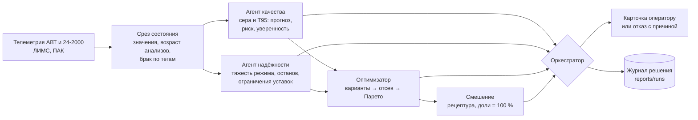

# МАС «Нефтекод»: АВТ → гидроочистка → блендинг

Мультиагентная система-советчик для оператора гидроочистки дизельного топлива. По
состоянию процесса она оценивает риск выхода продукта за спецификацию по сере и Т95,
сравнивает допустимые изменения режима и выдаёт объяснимую рекомендацию — или
мотивированно отказывается её давать, называя причину.

**Качество и технологические ограничения выше экономики**: вариант, нарушающий
жёсткое ограничение, отсекается до ранжирования и не может быть «оплачен» выпуском.
Система работает локально, без интернета; слой локальной LLM необязателен и выключен.

## За пять минут

| Хочу увидеть | Куда смотреть | Что там |
|---|---|---|
| всё решение слайдами | [docs/presentation.pptx](docs/presentation.pptx) | 14 слайдов; числа и вердикты собраны из отчётов скриптом [scripts/make_presentation.py](scripts/make_presentation.py) |
| главные числа | [Результаты на тесте](#результаты-на-тесте) | таблица по критериям ТЗ, у каждой строки — отчёт, из которого взято число |
| как система решает | [Как принимается решение](#как-принимается-решение) | схема агентов и живая карточка оператора |
| каждую строку карточки | [docs/CARD.md](docs/CARD.md) | откуда число, чем подтверждено, где допущение, чего в карточке нет и почему |
| систему в работе | `streamlit run app/dashboard.py` и [docs/SCENARIOS.md](docs/SCENARIOS.md) | пять сцен защиты на дашборде и шесть сценариев с возмущениями одной командой |
| где система молчит и почему | [docs/CARD.md → отказы](docs/CARD.md#что-происходит-когда-система-отказывается) | отказы стоят там, где врут приборы: это измерено |
| на каких данных | [Данные](#данные) | разбиение по времени, неисправные периоды с датами |
| что не получилось | [Ограничения](#ограничения) | честный список, у каждого пункта — чем измерено |
| как запустить | [Запуск](#запуск) | четыре команды |

## Результаты на тесте

Тест — 2026 год (с 01.01 по 07.08), в обучении и подборе порогов не участвовал.
Каждое число ниже сверяется с отчётом тестом `pytest`: переписанная фраза или
пересчитанный отчёт роняют проверку.

| Критерий | Что сделано | Результат | Где проверить |
|---|---|---|---|
| Работа с данными | синхронизация только по времени, возраст каждого анализа, задержка публикации ЛИМС 4 ч, детекторы заглушек, «полок» и останова | останов распознаётся отдельно: 54 % «зависаний» поточного анализатора приходятся на остановы | [reports/reliability_metrics.json](reports/reliability_metrics.json), [docs/DATA_PERIODS.md](docs/DATA_PERIODS.md) |
| Качество прогноза | виртуальный анализатор серы с калиброванным интервалом, уровень Т95 из лаборатории | MAE 1.29 мг/кг против 1.48 у поточного анализатора, ROC-AUC риска 0.82 (по MAE — не хуже прибора: парная разница на границе значимости); в окне от 2 ч до отбора до публикации анализа система реагирует на 77 % проб с превышением против 52 % нормальных | [reports/quality_metrics_h0.json](reports/quality_metrics_h0.json), [docs/QUALITY_AGENT.md](docs/QUALITY_AGENT.md) |
| Мультиагентность | агенты качества, надёжности, оптимизации, смешения и оркестратор с явным обменом типизированными структурами | одноагентная система двигает уставки в 12 раз больше (846 °C против 70.8 за полгода) | [reports/architectures.json](reports/architectures.json), [docs/HARD_CHECKS.md §7](docs/HARD_CHECKS.md#7-сравнение-архитектур-зачем-нужен-каждый-агент) |
| Оптимизация и безопасность | отсев до ранжирования, Парето, запрет частых воздействий, отказ | в замкнутой имитации июня 2026 число вмешательств за месяц — 3, они убирают 4 из 4 шагов с превышением, вклад в Т95 −0.08 °C | [reports/simulation.json](reports/simulation.json), [docs/HARD_CHECKS.md §6](docs/HARD_CHECKS.md#6-имитационная-среда-что-будет-если-оператор-послушается) |
| Надёжность | тяжесть режима по прокси, износ катализатора по журналу замен | активность катализатора падает на 0.85 °C/мес (95 % ДИ 0.71–0.98) | [reports/catalyst_life.json](reports/catalyst_life.json), [docs/CATALYST_LIFE.md](docs/CATALYST_LIFE.md) |
| Объяснимость | карточка: причина → действие → эффект → ограничения → уверенность → что дальше | при уверенности ниже 0.7 ошибка прогноза в 3.1–3.5 раза больше — число в карточке что-то значит | [reports/confidence_meaning.json](reports/confidence_meaning.json), [docs/CARD.md](docs/CARD.md) |
| Воспроизводимость | детерминированное обучение, все отчёты пересобираются одной командой | числа документов сверяются с отчётами тестами | [scripts/reproduce_all.sh](scripts/reproduce_all.sh), [tests/](tests/) |
| Закрытый контур | цикл решения проверен запуском с запретом сетевых соединений | внешних обращений нет | [scripts/check_offline.py](scripts/check_offline.py), [docs/DEPLOY.md](docs/DEPLOY.md) |

## Как принимается решение



Оркестратор проходит проверки в порядке важности: установка стоит или данные
недостоверны — отказ; ни один вариант не проходит жёсткие ограничения — отказ с
перечнем причин; риск ниже порога и текущий режим с запасом — держим режим; иначе
выбирается лучший из допустимых вариантов с учётом ограничений агента надёжности и
запрета частых воздействий. Агенты обмениваются типизированными структурами
([src/nefte/agents/schemas.py](src/nefte/agents/schemas.py)), каждый цикл целиком
пишется в журнал.

Пример карточки (`python scripts/run_cycle.py --ts "2026-03-05 00:00"`; строка
«Почему» сокращена):

```
[2026-03-05 00:00] Риск нарушения спецификации по сере: 54% (прогноз 10.16 мг/кг при пределе 10.0)
  Действие: T5: +0.12 → 379.82, T11: +0.13 → 373.62, F26: -6.63 → 225.68, P13: +0.01 → 3.92
  Эффект: сера 9.53 мг/кг (-0.63 к бездействию), Т95 346.1 °C (+0.05), выпуск -2.85 %,
          энергия -0.13 %, тяжесть режима 0.67, выпуск смеси 237.2 т/ч
  Проверено: сера ≤ 10.0 мг/кг (жёсткое, прогноз); Т95 ≤ 360.0 °C (жёсткое); уставки
          внутри модельного диапазона (допущение, p05–p95 истории); шаг за цикл ограничен;
          смесь — ДТ летнее товарное: ЦЧ ≥ 51.0, плотность 820–845; доли дают 100.0 %
  Уверенность: 0.56
  Почему: Из 73 допустимых вариантов (16 на фронте Парето) выбран mix_098 … запас по
          неопределённости не гарантирован … нужен контрольный лабораторный анализ.
          Агент надёжности ограничил T11, T5, T6 … приращение от уставок посчитано по
          кинетике (порядок 1.5): это внутри 0.3–1 мг/кг на градус, названных технологами.
  Что дальше: следующий анализ примерно через 16.5 ч, ждём 7.4–12.9 мг/кг — так попадали
          8 раз из 10; до него будет сделано около 3910 т продукта; эффект правки проявится
          за ~4.6 ч; ВНИМАНИЕ: режим уже идёт вверх на 2.93 °C за последние 4.6 ч —
          не складывайте воздействия.
  Смешение (допустима, сумма долей 100.0 %): ГО ДТ 100.0 %
```

Строки «Достоверность», «Разбор причины» и «Возврат в норму» появляются, только когда
им есть что сказать. Все строки, их источники и то, чего в карточке нет, —
[docs/CARD.md](docs/CARD.md).

## Данные

| | Что |
|---|---|
| Источники | телеметрия АВТ и 24-2000 (шаг 10 минут), лабораторные анализы ЛИМС, поточный анализатор ПАК, таблица тегов — пакет организаторов без изменений |
| Обучение | 2023-01-01 … 2025-06-30 |
| Валидация | 2025-07-01 … 2025-12-31 — подбор порогов и все правила приёмки |
| Тест | 2026-01-01 … 2026-08-07 — только отчёт |
| Неисправные периоды | [docs/DATA_PERIODS.md](docs/DATA_PERIODS.md): остановы, полки анализаторов, молчание лаборатории — с датами и причинами. Мы их не вырезаем: система в них отказывается, называя причину, и все метрики посчитаны вместе с ними |
| Ловушки и допущения | [docs/DATA_NOTES.md §2](docs/DATA_NOTES.md#2-ловушки-главное) — что в данных устроено не так, как кажется; [§5](docs/DATA_NOTES.md#5-чего-в-пакете-нет-объявленные-допущения) — чего в пакете нет и что мы допустили; ответы организаторов и записи сессий — там же, §5а–5в |

Данные в репозитории не хранятся. Выданные файлы организаторов и обученные модели
приложены отдельным архивом `neftekod_data.zip`: внутри `ДАННЫЕ.txt` — куда что
положить; путь к данным задаётся в `.env` (образец — [.env.example](.env.example)).
Модели можно и не брать: `python scripts/train_quality.py --horizon 0` обучает
рабочую за несколько минут на CPU.

## Запуск

```bash
git clone https://github.com/imaO0O/mac-2026-hackaton.git
cd mac-2026-hackaton
python -m venv .venv && .venv\Scripts\activate
pip install -r requirements.txt && pip install -e .
```

Пути к выданным данным — в `.env` (`NEFTE_SOURCE_DIR`, `NEFTE_DATA_DIR`), дальше:

```bash
python scripts/prepare_data.py              # распаковка и кэш, ~2 минуты, один раз
python scripts/train_quality.py --horizon 0 # модель качества, CPU, ~3 минуты
python scripts/run_cycle.py --ts "2026-03-05 00:00"   # одна карточка решения целиком
streamlit run app/dashboard.py              # дашборд: сцены защиты и путь решения по агентам
```

| Ещё | Команда |
|---|---|
| все тесты; без выданных данных — только код и контракты, как в CI | `pytest -q` / `NEFTE_NO_DATA=1 pytest -q` |
| сценарий с возмущением: эксперт меняет условия — система отвечает | `python scripts/run_scenario.py --list` ([docs/SCENARIOS.md](docs/SCENARIOS.md)) |
| пересобрать все отчёты одной командой (прерываемо, продолжает с места) | `bash scripts/reproduce_all.sh` |
| цикл решения как локальный HTTP-сервис | `python -m nefte.service` ([docs/DEPLOY.md](docs/DEPLOY.md)) |
| все остальные команды | [docs/FINDINGS.md → Все команды](docs/FINDINGS.md#все-команды) |

## Главные выводы

* **Отказ — это решение, и он стоит там, где надо.** В отказах по недостоверным
  данным поточный анализатор расходится с лабораторией в восемь с половиной раз
  сильнее, чем в моментах с решением, а доля превышений в них не выше обычной
  ([docs/CARD.md](docs/CARD.md#что-происходит-когда-система-отказывается)).
* **Модель качества — виртуальный анализатор, а не модель процесса.** От показания
  прибора она зависит почти один к одному, от температуры реактора — почти никак:
  отклик на уставки из истории не выучить, его гасят контуры регулирования. Поэтому
  приращение от уставок считает кинетика, и карточка это говорит
  ([docs/SCENARIOS.md → чем сдвигается прогноз](docs/SCENARIOS.md#чем-сдвигается-прогноз-а-чем-нет)).
* **Сера сырья не двигает прогноз, режим колонны АВТ — двигает, но слабо.** Совпало с
  ответом технолога: серу сырья с серой продукта связать не удастся
  ([docs/QUALITY_AGENT.md](docs/QUALITY_AGENT.md#почему-прогноз-такой-разбор-по-группам-каналов)).
* **Каждая включённая настройка включена правилом, записанным до счёта, а
  отклонённые записаны с числами так же подробно.** Журнал решений и отказов —
  [docs/PLAN.md](docs/PLAN.md), отчёт каждой проверки — в [reports/](reports/).

## Ограничения

* **За сутки вперёд система не предупреждает.** Она реагирует на уже идущее
  превышение; прогноз на 2 часа у бустинга не работает (ROC-AUC 0.37).
* **Отклик серы на режим измерен не нами, а названием практики.** Технолог на
  сессии 11.09 назвал 0.3–1.0 мг/кг на градус (ответ потерян в присланной
  расшифровке и восстановлен из записи, вторым проходом дословно). Рабочая
  кинетика — порядок 1.5, это 0.46 мг/кг на градус, середина названного диапазона;
  первый порядок давал 1.55 — выше практики. На истории отклик выглядит в разы
  слабее, и эксперт назвал причину: его гасят контуры регулирования. Поэтому запас
  по сере у варианта обязан держаться и при более слабом отклике (робастная
  гарантия, включена после проверки по правилу, записанному до счёта). При таком
  отклике замкнутый контур делает не больше 3 вмешательств (при принятом отклике —
  3) и всё равно убирает превышения ([docs/SULFUR_RESPONSE.md](docs/SULFUR_RESPONSE.md)).
* **Рабочие диапазоны уставок — квантили истории**: паспортных ограничений в пакете
  нет и не будет — эксперт назвал их конфиденциальными. Выход за диапазон карточка
  называет вместе с путём возврата, а температуру выше диапазона в пределах
  старения катализатора назад не отправляет ([docs/SCENARIOS.md](docs/SCENARIOS.md)).
  Смешение — модель на явных допущениях: данных по компонентам не выдано
  ([docs/BLENDING.md](docs/BLENDING.md)).
* **Т95 — ограничение «не ухудшать», а не гарантия.** Ни одна оценка не ловит
  превышения Т95 заранее: MAE около 5 °C при запасе до предела 3–5 °C
  ([docs/PLAN.md](docs/PLAN.md)).
* **Управляющие воздействия — только гидроочистки.** Схемы АВТ с кодами тегов
  сверены ([docs/AVT_SCHEMES.md](docs/AVT_SCHEMES.md)). Связь АВТ с гидроочисткой
  измерена и оказалась слабой: после каналов, повторяющих измеренную серу, прогноз
  ведут каналы режима колонны АВТ — в признаках это средние за 6–144 ч (81 % решений
  на тесте), но сдвиг прогноза от утяжеления сырья на +5 °C всего 0.03 мг/кг. Средние
  здесь подавляют шум, а не изображают резервуарный парк: сама связь АВТ с
  гидроочисткой сильнее всего видна без сглаживания
  ([docs/AVT_TO_HT_LAG.md](docs/AVT_TO_HT_LAG.md)). Сернистость сырья не влияет
  вовсе: +10 мг/кг к ней двигают прогноз на 0.000.

Все допущения — [docs/DATA_NOTES.md §5](docs/DATA_NOTES.md#5-чего-в-пакете-нет-объявленные-допущения)
и `assumption: true` в [configs/config.yaml](configs/config.yaml).

## Структура репозитория

| Путь | Что там |
|---|---|
| [app/dashboard.py](app/dashboard.py) | дашборд оператора: карточка, путь решения по агентам, достоверность данных, сцены защиты |
| [src/nefte/agents/](src/nefte/agents/) | агенты: [качество](src/nefte/agents/quality.py), [надёжность](src/nefte/agents/reliability.py), [оптимизатор](src/nefte/agents/optimizer.py), [смешение](src/nefte/agents/blending.py), [оркестратор](src/nefte/agents/orchestrator.py), [«что дальше»](src/nefte/agents/outlook.py), [контракты](src/nefte/agents/schemas.py) |
| [src/nefte/models/](src/nefte/models/) | модель серы и Т95 ([quality_model.py](src/nefte/models/quality_model.py)), кинетика, формулы ВАК, катализатор, разбор причины прогноза |
| [src/nefte/pipeline.py](src/nefte/pipeline.py) | срез состояния: синхронизация по времени, возраст анализов, детекторы неисправных данных |
| [scripts/](scripts/) | запуск, прогоны и проверки; правило приёмки каждой проверки — в её докстринге |
| [reports/](reports/) | результаты: каждый вывод документации опирается на отчёт отсюда |
| [tests/](tests/) | тесты, включая сверку чисел документации с отчётами и ссылок документов |
| [configs/config.yaml](configs/config.yaml) | все настройки с обоснованием; допущения помечены `assumption: true` |
| [docs/](docs/) | документация — таблица ниже |

## Документы

| Документ | Что там смотреть |
|---|---|
| [docs/CARD.md](docs/CARD.md) | карточка оператора: каждая строка, её источник, чего в карточке нет и почему; качество отказов |
| [docs/SCENARIOS.md](docs/SCENARIOS.md) | шесть сценариев: как отвечает система, когда меняют условия; чем сдвигается прогноз |
| [docs/DATA_NOTES.md](docs/DATA_NOTES.md) | данные: ловушки, ответы организаторов, записи сессий, допущения — читать первым |
| [docs/DATA_PERIODS.md](docs/DATA_PERIODS.md) | где данные неисправны: с какого по какое, почему и что делает система |
| [docs/HARD_CHECKS.md](docs/HARD_CHECKS.md) | «злые» случаи, прогон по тесту, имитация замкнутого контура, сравнение архитектур |
| [docs/QUALITY_AGENT.md](docs/QUALITY_AGENT.md), [docs/RELIABILITY_AGENT.md](docs/RELIABILITY_AGENT.md), [docs/OPTIMIZER_AGENT.md](docs/OPTIMIZER_AGENT.md), [docs/BLENDING.md](docs/BLENDING.md) | агенты по отдельности: как устроены и что измерено |
| [docs/DEPLOY.md](docs/DEPLOY.md) | что нужно интегратору: точка стыковки, закрытый контур, что придётся доделать |
| [docs/FINDINGS.md](docs/FINDINGS.md) | все команды, структура кода, журнал находок по каждому агенту |
| [docs/DEFENSE_QUALITY.md](docs/DEFENSE_QUALITY.md) | что говорить на защите и чего не говорить |
| [docs/presentation.pptx](docs/presentation.pptx) | презентация: что делает система, главные числа, решения по правилам до счёта; в заметках к слайдам — что говорить |
| [docs/PLAN.md](docs/PLAN.md) | журнал работ: каждое принятое и отклонённое решение с правилом, записанным до счёта |
