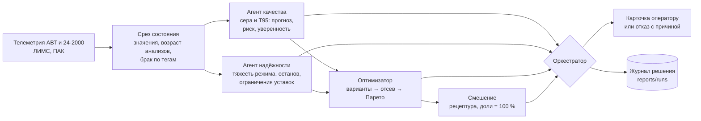

# МАС «Нефтекод»: АВТ → гидроочистка → блендинг

Мультиагентная система-советчик для оператора гидроочистки дизельного топлива. По
состоянию процесса она оценивает риск выхода продукта за спецификацию, сравнивает
допустимые изменения режима и выдаёт объяснимую рекомендацию — или мотивированно
отказывается её давать.

**Качество и технологические ограничения выше экономики**: вариант, нарушающий
жёсткое ограничение, отсекается до ранжирования и не может быть «оплачен»
выпуском. Система работает локально, без интернета и без LLM.

## Как принимается одно решение



Оркестратор проходит проверки в порядке важности: установка стоит или данные
недостоверны — отказ; ни один вариант не проходит жёсткие ограничения — отказ с
перечнем причин; риск ниже порога и текущий режим с запасом — держим режим; иначе
выбирается лучший из допустимых вариантов с учётом ограничений агента надёжности и
запрета частых воздействий. Агенты обмениваются типизированными структурами
(`src/nefte/agents/schemas.py`), каждый цикл целиком пишется в журнал.

Пример карточки (`python scripts/run_cycle.py --ts "2026-02-18 00:00"`):

```
[2026-02-18 00:00] Риск нарушения спецификации по сере: 41% (прогноз 9.57 мг/кг при пределе 10.0)
  Действие: F26: -6.64 → 214.60
  Эффект: сера 7.72 мг/кг (-1.85 к бездействию), Т95 345.0 °C (+0.00), выпуск -3.00 %, энергия -0.36 %, тяжесть режима 0.73, выпуск смеси 231.9 т/ч
  Проверено: сера ≤ 10.0 мг/кг (жёсткое, прогноз); Т95 ≤ 360.0 °C (жёсткое, прогноз: уровень из лаборатории, приращение по формуле ВАК); уставки внутри модельного диапазона (допущение, p05–p95 истории); шаг изменения за цикл ограничен; цетановое число ≥ 51.0, плотность и ПТФ — по последнему анализу, при смене режима НЕ прогнозируются; доли компонентов смешения дают 100.0 % (жёсткое требование ТЗ)
  Уверенность: 0.56
  Почему: Из 36 допустимых вариантов (16 на фронте Парето) выбран F26=214.60 … ВНИМАНИЕ: запас по сере держится при принятой кинетике (7.72 + 1.83 мг/кг), но не при втрое более слабом отклике (9.29 + 1.83 при пределе 10). Отклик на режим не измерен, поэтому гарантии нет: нужен контрольный лабораторный анализ, и может понадобиться ещё шаг. …
  Смешение (допустима, сумма долей 100.0 %): ГО ДТ 100.0 %
```

## Запуск

```bash
git clone https://github.com/imaO0O/mac-2026-hackaton.git
cd mac-2026-hackaton
python -m venv .venv && .venv\Scripts\activate
pip install -r requirements.txt && pip install -e .
```

Пути к выданным данным задаются в `.env` (`NEFTE_SOURCE_DIR`, `NEFTE_DATA_DIR`, образец —
`.env.example`), дальше три команды:

```bash
python scripts/prepare_data.py              # распаковка и кэш, ~2 минуты, один раз
python scripts/train_quality.py --horizon 0 # модель качества, CPU, ~3 минуты
python scripts/demo.py                      # семь сцен защиты, ~3 минуты
```

Дашборд оператора — `streamlit run app/dashboard.py`: сцены защиты и путь решения
по агентам. Проверка — `pytest -q`; на машине без выданных данных —
`NEFTE_NO_DATA=1 pytest -q` (так тесты идут в GitHub Actions). Пересобрать все
отчёты одной командой — `bash scripts/reproduce_all.sh`. Для интеграции с системой
сбора данных цикл решения поднимается локальным HTTP-сервисом без внешних
зависимостей — `python -m nefte.service` (`GET /health`, `GET /decide?ts=…`,
`POST /decide` со срезом `ProcessState`). Остальные команды — `docs/FINDINGS.md`.

## Что получилось — по критериям ТЗ

Тест — 2026 год, в обучении и подборе порогов не участвовал.

| Критерий | Что сделано | Результат |
|---|---|---|
| Работа с данными | синхронизация только по времени, возраст каждого анализа, задержка публикации ЛИМС 4 ч, детекторы заглушек, «полок» и останова | останов распознаётся отдельно: 54 % «зависаний» поточного анализатора приходятся на остановы |
| Качество прогноза | виртуальный анализатор серы с калиброванным интервалом, уровень Т95 из лаборатории | MAE 1.29 мг/кг против 1.48 у поточного анализатора, ROC-AUC риска 0.82; в окне от 2 ч до отбора до публикации анализа система реагирует на 83 % проб с превышением против 49 % нормальных |
| Мультиагентность | агенты качества, надёжности, оптимизации, смешения и оркестратор с явным обменом | одноагентная система двигает уставки в 21 раз больше (810 °C против 38.2 за полгода) |
| Оптимизация и безопасность | отсев до ранжирования, Парето, запрет частых воздействий, отказ | в замкнутой имитации июня 2026 число вмешательств за месяц — 3, они убирают 4 из 4 шагов с превышением, вклад в Т95 −0.01 °C |
| Надёжность | тяжесть режима по прокси, дезактивация катализатора | активность катализатора падает на 0.85 °C/мес (95 % ДИ 0.71–0.98) |
| Объяснимость | карточка: причина → действие → эффект → ограничения → уверенность | пример выше |
| Воспроизводимость | детерминированное обучение, числа документов сверяются с отчётами тестами | `pytest -q` |
| Закрытый контур | цикл решения проверен запуском с запретом сетевых соединений | `python scripts/check_offline.py` |

## Ограничения, которые мы знаем

* **За сутки вперёд система не предупреждает.** Она реагирует на уже идущее
  превышение; прогноз на 2 часа у бустинга не работает (ROC-AUC 0.41).
* **Отклик серы на режим — допущение.** Кинетика первого порядка даёт −22 % серы на
  градус при литературных 5–10 %. Поэтому запас по сере у варианта обязан
  держаться и при втрое более слабом отклике (робастная гарантия, включена после
  проверки по правилу, записанному до счёта). При таком отклике замкнутый контур
  делает 7–8 вмешательств вместо 3 и всё равно убирает превышения.
* **Рабочие диапазоны уставок — квантили истории**, паспортных ограничений в пакете
  нет. Смешение — модель на явных допущениях: данных по компонентам не выдано.
* **Управляющие воздействия — только гидроочистки.** Схемы АВТ с кодами тегов
  сверены (`docs/AVT_SCHEMES.md`), но связь режима АВТ с сырьём гидроочистки не
  установлена.

Все допущения — `docs/DATA_NOTES.md` §5 и `assumption: true` в `configs/config.yaml`.

## Где что

| Документ | О чём |
|---|---|
| `docs/FINDINGS.md` | все команды, структура кода, что сделано и что нашли по каждому агенту |
| `docs/DATA_NOTES.md` | данные: ловушки, ответы организаторов, допущения — читать первым |
| `docs/HARD_CHECKS.md` | «злые» кейсы, прогон по тесту, имитация замкнутого контура |
| `docs/QUALITY_AGENT.md`, `docs/RELIABILITY_AGENT.md`, `docs/OPTIMIZER_AGENT.md`, `docs/BLENDING.md` | агенты по отдельности |
| `docs/DEFENSE_QUALITY.md` | что говорить на защите и чего не говорить |
| `docs/PLAN.md` | план доработки и разделение работ |
